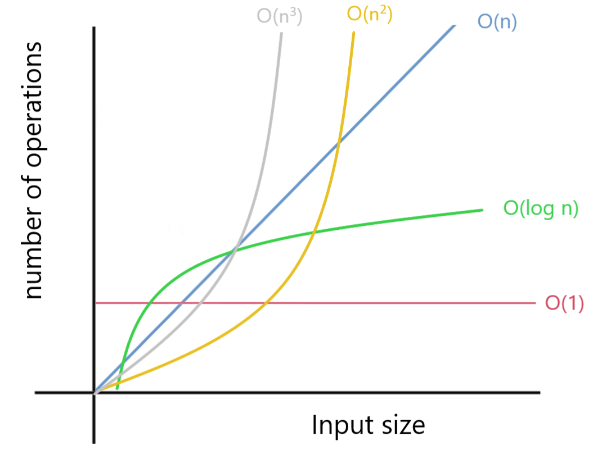

# Understanding Big O Notation

## Big O Notation

- Measures the worst-case complexity of an algorithm
    - Time complexity: time taken to run completely
    - Space complexity: extra memory space
- Doesn't use seconds or bytes as a measure.
    - Different results depending on the hardware.
- Instead, we use mathematical expressions like $O(1)$, $O(n)$, $O(n^2) \dots$



We can see how, if the number of inputs increases, the number of operations increases.

An example of $O(1)$ time complexity would be as follows:

```python
colors = ["green", "yellow", "blue", "pink"]


def constant(colors):
    print(colors[2])


constant(colors)
```

returns `blue`, the third value of the list, since in Python the index of a list starts with zero. Critically, even if
we add more inputs to the list `colors`, this will not change the value printed. Hence, constant time complexity.

An example of $O(n)$ time complexity is as follows:

```python
colors = ["green", "yellow", "blue", "pink"]


def linear(colors):
    for color in colors:
        print(color)


linear(colors)
```

The loop will iterate over all the elements in the list, each time printing the element it is on. Since colors is a list
of four elements, `n=4`. If our colors list had 7 elements, $n$ would equal $7$. As you can see, this is a linear
relationship, because if the number of elements of the list increases by 1 unit, then our number of operations will
increase by 1 unit.

An example of $O(n^2)$ (quadratic time complexity) would be:

```python
colors = ["green", "yellow", "blue"]


def quadratic(colors):
    for first in colors:
        for second in colors:
            print(first, second)


quadratic(colors)
```

The `quadratic` function contains a nested loop. For each element in the list `colors`, we print the current element of
the list `colors` for the first loop, and the current element of the second loop. If the number of elements in our list
is 3, then we perform 9 operations. If the number of elements in our list is 100, we perform 10000 operations, and so
on. Hence, quadratic time complexity.

An example of $O(n^3)$ (cubic time complexity) would be:

```python
colors = ["green", "yellow", "blue"]


def cubic(colors):
    for color1 in colors:
        for color2 in colors:
            for color3 in colors:
                print(color1, color2, color3)


cubic(colors)
```

If the number of elements in your list is 3, the total number of operations is 27. If the number of elements in your
list is 10, you perform 1000 operations, and so on. Hence, cubic time complexity.

## Calculating Big O Notation
```python
colors = ["green", "yellow", "blue", "pink", "black", "white", "purple"]  # O(1)
other_colors = ["orange", "brown"]  # O(1)


def complex_algorithm(colors):
    color_count = 0  # O(1)
    
    for color in colors:
        print(color)  # O(n)
        color_count += 1  # O(n)

    for other_color in other_colors:
        print(other_color)  # O(m)
        color_count += 1  # O(m)
    
    print(color_count)  # O(1)


complex_algorithm(colors)  # O(4 + 2n + 2m)
```

We will need to simplify $O(4 + 2n + 2m)$ by applying some rules.

## Simplifying Big O Notation
1. Remove constants
   -  $O(4 + 2n + 2m) \rightarrow O(n+m)$
2. Different variables for different inputs
    - $O(n+m)$
3. Remove smaller terms
    - $O(n+n^2) \rightarrow O(n^2)$