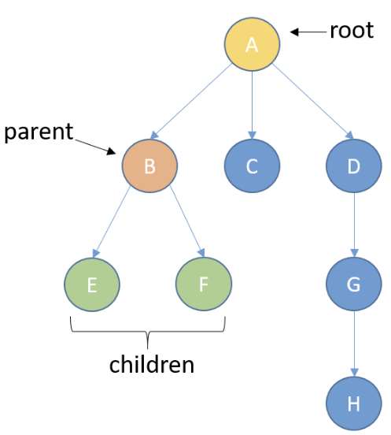
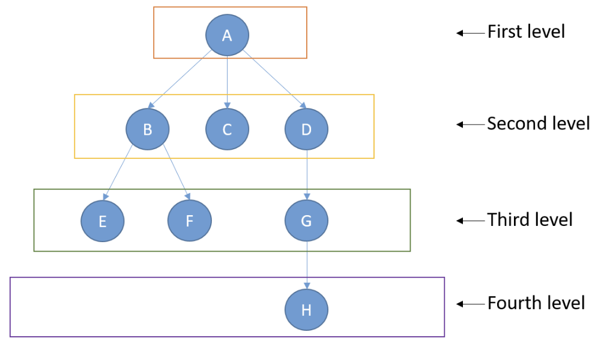
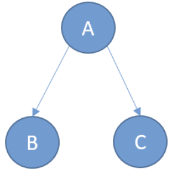
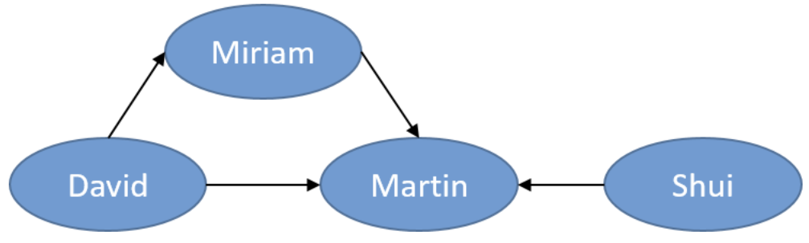
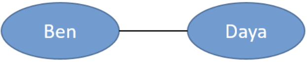
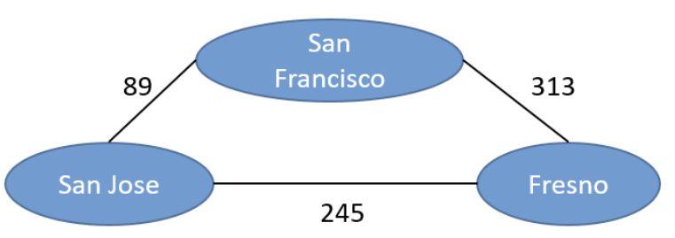
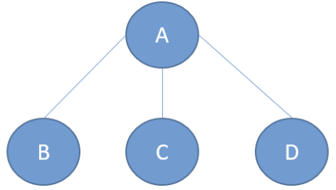
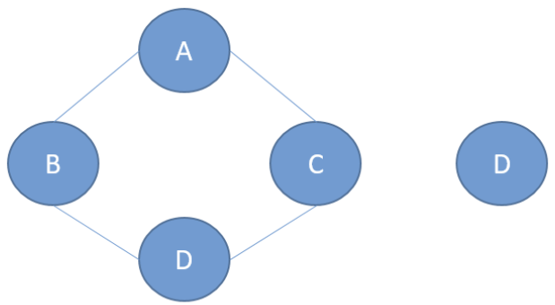

# Trees and Graphs

## Definition

Trees are node-based data structures where each node can have links to more than one node.

The first node of the tree is called the root. A node can be the parent of other nodes. These other nodes are called
children.



Trees have an associated level of depth:



## Binary Tree

A special kind of tree, where each node has zero, one, or two children.

### Implementation

```python
class TreeNode:
    def __init__(self, data, left=None, right=None):
        self.data = data,
        self.left_child = left
        self.right_child = right
```

To build a tree like this one:



We can use this code:

```python
class TreeNode:
    def __init__(self, data, left=None, right=None):
        self.data = data,
        self.left_child = left
        self.right_child = right


node1 = TreeNode("B")
node2 = TreeNode("C")
root_node = TreeNode("A", node1, node2)
```

## Trees -- Real Uses

- Storing hierarchical relationships
    - File system of a computer
    - Structure of an HTML document
- Draughts: possible moves of the opponent
- Searching and sorting algorithms

## Graphs

A graph is a data structure formed by a set of nodes, also known as vertices. The nodes are connected by links, also
known as edges.

This graph could represent a social network where, say, the edges represent friendship status between people. Trees are
a type of graph.

### Types of Graphs

- Directed graphs:
    - When they have one specific direction.



For example, as we can see above, David follows Martin and Miriam, but neither Miriam nor Martin follow him back.

- Undirected graphs:
  - Edges have no direction
  - The relationship is mutual. 



For example, the friendship between Ben and Daya is mutual.

- Weighted graphs
  - Numeric values associated with the edges
  - Can be either directed or undirected



For example, as we can see above, the distances between different cities.

## Comparing Graphs and Trees
Let's understand the differences between trees and graphs. 

### Trees
- Cannot have cycles
- All nodes must be connected


### Graphs
- Can have cycles
- There can be unconnected nodes


## Graphs - Real Use Cases
- User relationships in social networks
  - Friendship status
  - Follows
  - Likes
- Locations and distances between locations
  - Optimize routes
- Graph databases
- As trees, graphs appear in many searching and sorting algorithms.

## Graphs Implementation
```python
class Graph:
    def __init__(self):
        self.vertices = {}
    
    def add_vertex(self, vertex):
        self.vertices[vertex] = []

    def add_edge(self, source, target):
        self.vertices[source].append(target)


my_graph = Graph()
my_graph.add_vertex("Marwin")
my_graph.add_vertex("Leticija")
my_graph.add_vertex("Dorottya")

my_graph.add_edge("Marwin", "Leticija")
my_graph.add_edge("Marwin", "Dorottya")
my_graph.add_edge("Leticija", "Dorottya")

print(my_graph.vertices)
```

We could use adjacency matrices instead, but they are out of the scope of the course.