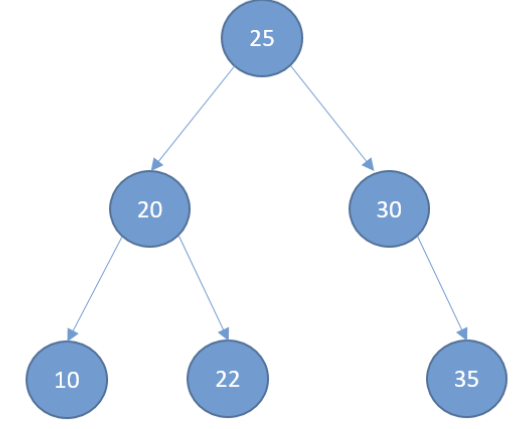
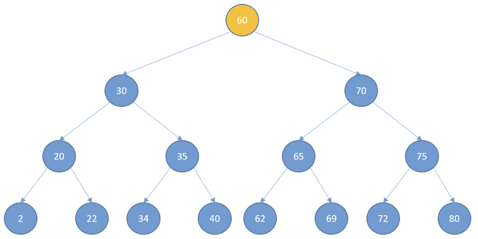

# Binary Search Tree

Binary search trees are a special kind of binary tree. A binary tree is a tree where each node has zero, one, or two
children.

## Definition



- Left subtree of a node
    - values less than the node itself
- Right subtree of a node:
    - values greater than the node itself
- Left and right subtrees must be binary search trees.

## Implementation

Using the familiar `TreeNode` class:

```python
class TreeNode:
    def __init__(self, data, left=None, right=None):
        self.data = data
        self.left_child = left
        self.right_child = right
```

```python
class BinarySearchTree:
    def __init__(self):
        self.root = None
```

Suppose we want to search for the number 72:



72 is greater than 60, so we continue searching on the right-hand side of the tree. As 72 is greater than 70, we
continue on the right-hand side of the subtree. We compare 72 with 75, and as it's less, we continue on the left-hand
side of the sub-tree and find the value 72.

### Search Implementation

```python
def search(self, search_value):
    current_node = self.root
    while current_node:
        if search_value == current_node.data:
            return True
        elif search_value < current_node.data:
            current_node = current_node.left_child
        else:
            current_node = current_node.right_child
    return False
```

## Insertion

We first create a new node containing the data. If the tree doesn't already have a root node, the new node is the root
node, and the execution finishes. If the tree already has a root, then the parent node is the root. We check if the
value, if the new node is less than the parent node. If it is, we insert on the left hand side, so the new node becomes
the root nodes left child. Let's look at an example where we try to insert a value where new node's value is greater
than current node's value. If root node doesn't have a right child, the new node becomes the right child of the root
node. But, if root node does have a right child, then current node is set to the right child of root node, and the
iteration continues. Again we compare new_node with current node. If new node is less than current node and current node
does not have a left child, new node becomes the left child of current node and the execution stops.

## Deletion

If the node we want to delete has no children, we delete it. If the node has one child, we delete the node and connect
the child with the node's parents. If the node being deleted has two children, we replace it with its successor. The
successor is the node with the smallest value greater than the value of the node you want to delete. To find the
successor, you visit the right child and delete it, and keep visiting the left nodes until the end. Then, replace the
node with its successor. If the successor has a right child, the child becomes the left child of the successor's parent.

## Implementing Insertion & Deletion

Let's now implement the insert and delete operations:

```python
class TreeNode:
    def __init__(self, data, left=None, right=None):
        self.data = data
        self.left_child = left
        self.right_child = right


class BinarySearchTree:
    def __init__(self):
        self.root = None

    def insert(self, data):
        new_node = TreeNode(data)
        if self.root is None:
            return
        else:
            current_node = self.root
            while True:
                if data < current_node.data:
                    if current_node.left_child is None:
                        current_node.left_child = new_node
                        return
                    else:
                        current_node = current_node.left_child
                elif data > current_node.data:
                    if current_node.right_child is None:
                        current_node.right_child = new_node
                        return
                else:
                    current_node = current_node.right_child
```

## Uses of Binary Search Trees
- Can be used to order lists efficiently. 
- When adding or removing elements, there is no need to reorder all the elements again
- They are faster at searching than arrays or linked lists. 
- Much faster at inserting and deleting than arrays
- Used to implement more advanced data structures such as
  - Dynamic sets
  - Lookup tables
  - Priority queues